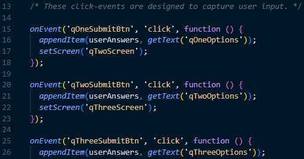
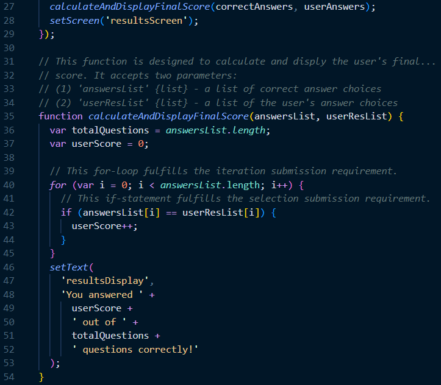
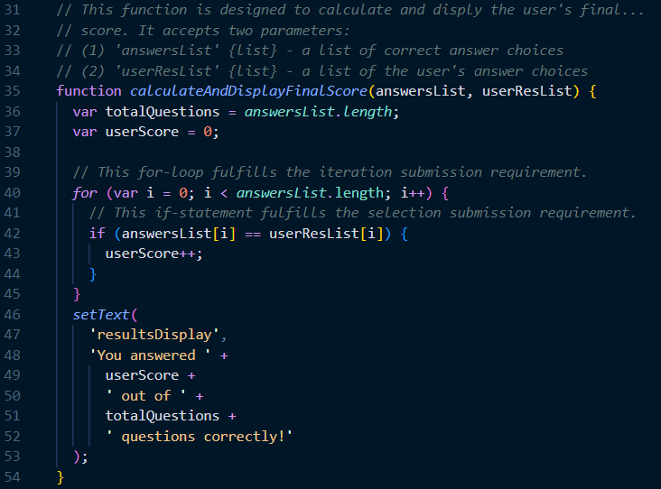
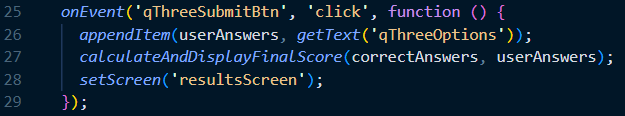

# AP CSP Create Task Exemplar: A Sports Quiz App

Programming is a collaborative and creative process that brings ideas to life through the development of software. In the Create performance task, you will design and implement a program that might solve a problem, enable innovation, explore personal interests, or express creativity. Your submission must include elements listed in the following "Submission Requirements" sections.

### Program Code Submission Requirements

In your program you must include student-developed program code that contains the following:

- Instructions for **input** from one of the following:
  - the user (including user actions that trigger events)
  - a device
  - an online data stream
  - a file
- Use of at least one **list** (or other collection type) to represent a collection of data that is stored and used to manage program complexity and help fulfill the program's purpose.
  - Note, _the data abstraction must make the program easier to develop_ (alternatives would be more complex) or easier to maintain (future changes to the size of the list would otherwise require significant modifications to the program code).
- At least one **procedure (a.k.a. "function")** that contributes to the program's intended purpose, where you have defined:
  - the procedure's name
  - the return type (if necessary)
  - one or more parameters
- An **algorithm** that includes sequencing, selection, and iteration that is in the body of the selected procedure
- Calls to your student-developed procedure
- Instructions for **output** (tactile, audible, visual, or textual) **based on input** and program functionality

### Video Submission Requirements

Submit one video file that demonstrates your program running. It must include:

- **input** to your program
- at least one aspect of the functionality of your program
- **output** produced by your program

It may **NOT** contain:

- any distinguishing information about yourself
- voice narration (though text captions are encouraged)

It must be:

- either .mp4, .wmv, .avi, or .mov format
- no more than 1min in length
- no more than 30mb file size

### Exemplar Written Responses

Submit your responses to prompts 3(a) – 3(d), which are described below. Your responses to all prompts combined must not exceed 750 words (program code is not included in the word count).

**3(a).** In ~150 total words provide a written response that does all three of the following:

1. Describes the overall **purpose** of the program

_The purpose of my sports quiz program is to challenge user's knowledge of famous basketball players. The program displays a series of questions to the user, and the user must select an answer from a list of options. After answering all of the questions, the program calculates the user's score and displays it on the screen. The goal of the program is to provide an entertaining and educational experience for users who are interested in basketball._

2. Describes what **functionality** of the program is demonstrated in the video

_The video demonstrates the program's core functionality, including its ability to display questions, accept input from a user, and calculate and display their final score. The video also demonstrates the use of buttons to navigate between different screens in the program._

3. Describes the **input** and **output** of the program demonstrated in the video

_The **input** to the program in the video is user-selected answers to each question, which are stored in a list. The **output** is the final score, displayed on the screen at the end of the quiz._

**3(b).** Capture and paste two program code segments you developed during the administration of this task that contain a list (or other collection type) being used to manage complexity in your program.

1. The first program code segment must show how data have been stored in the list.

2. The second program code segment must show the data in the same list being used, such as creating new data from the existing data or accessing multiple elements in the list, as part of fulfilling the program’s purpose

Then provide a ~200 word written response that does all three of the following:

3. Identifies the **name of the list** being used in this response

_correctAnswers_, _userAnswers_

4. Describes what the data contained in the list represents in your program

_The two lists in the program, 'correctAnswers' and 'userAnswers', represent the correct answer choices and the user-selected answer choices, respectively, for the three questions in the sports quiz. The 'correctAnswers' list is pre-populated with the correct answers, and the 'userAnswers' list is populated in real time as the user responds to the quiz questions. The lists are then used to calculate and display the user's final score._

5. Explains how the selected list manages complexity in your program code by explaining why your program code could not be written or how it would be written differently if you did not use the list

_The selected lists manage data in this program, simplify the code, and make it more modular. Without these lists, I would need to write the code differently using individual variables to store each answer choice for each question. All of these variables would result in more complex and repetitive code with many conditional statements to check for the correctness of each answer. Moreover, if the quiz contained more questions, the complexity of the code would rapidly grow. These lists make the program code more efficient because they let me iterate over and compare the user's answers with the correct answers. They also make it easy for me to add or remove questions from the quiz since they can be modified, making the code more maintainable and extensible._

**3(c).** Capture and paste two program code segments you developed during the administration of this task that contain a student-developed procedure (a.k.a. “function”) that implements an algorithm used in your program and a call to that procedure.

1. The first program code segment must be a student-developed procedure that:

- Defines the **procedure's name** and return type (if necessary)
- contains and uses one or more **parameters** that have an effect on the functionality of the procedure
- implements an **algorithm** that includes sequencing, selection, and iteration

2. The second program code segment must show where your student-developed procedure is being called in your program

Then, provide a ~200 word written response that does both of the following:

3. Describes in general what the identified procedure does and how it contributes to the overall functionality of the program
4. Explains in detailed steps how the algorithm implemented in the identified procedure works. Your explanation must be detailed enough for someone else to recreate it.

_The ‘calculateAndDisplayFinalScore’ procedure calculates and displays the user's final score after they have completed the sports quiz. It is a critical part of the program as it is responsible for evaluating the user's answers and displaying their final score, providing feedback to the user, and allowing them to assess their understanding of the material._

_The algorithm implemented in the calculateAndDisplayFinalScore procedure works as follows:_

1. _Declare variables ‘totalQuestions’ and ‘userScore’ and assign their initial values to be [0]_
2. _Use a for-loop to iterate through each question in the given ‘answersList’._
3. _For each question, use an if-statement to compare the corresponding user response in ‘userResList’ with the correct answer in ‘answersList’._
4. _If the user response is correct, increment ‘userScore’._
5. _After iterating through all questions, calculate the percentage of correct answers by dividing ‘userScore’ by ‘totalQuestions’._
6. _Use the setText function to display the user's score as a message on the screen._

_By using this algorithm, the 'calculateAndDisplayFinalScore' procedure accurately evaluates the user's performance and provides them with final score._

**3(d).** Provide a ~200 word written response that does all three of the following:

1. Describes two calls to the procedure identified in written response 3(c). Each call must pass a different argument(s) that causes a different segment of code in the algorithm to execute.

- first call:

**calculateAndDisplayFinalScore([“Kobe”, “Jordan”, Lebron”], [“Lebron”, “Jordan”, “Kobe”]);**

- second call:

**calculateAndDisplayFinalScore([23, 8, 6], [23, 8, 6]);**

2. Describe what condition(s) is being tested by each call to the procedure.

- condition(s) tested by the first call:

_The first call tests the caluclateAndDisplayFinalScore function by passing a list of correct answers as the first parameter and user-selected answers as the second. The elements in these lists are not perfectly aligned._

- condition(s) tested by the second call:

_The second call tests the caluclateAndDisplayFinalScore function by passing a list of correct answers as the first parameter and user-selected answers as the second. The elements in these lists are perfectly aligned._

3. Identifies the result of each call.

- result of the first call:

_As a result of the first call, the program will generate a string -- "You answered 1 out of 3 questions correctly!" -- and put it on display for the user._

- result of the second call:

_As a result of the second call, the program will generate a string -- "You answered 3 out of 3 questions correctly!" -- and put it on display for the user._
